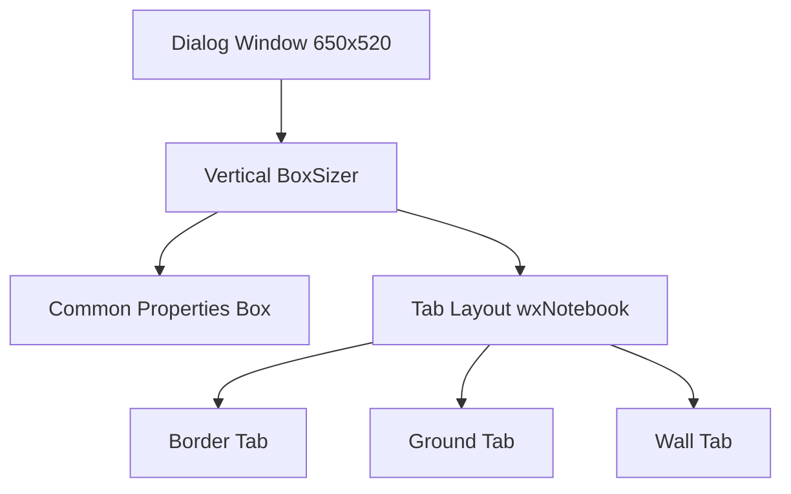
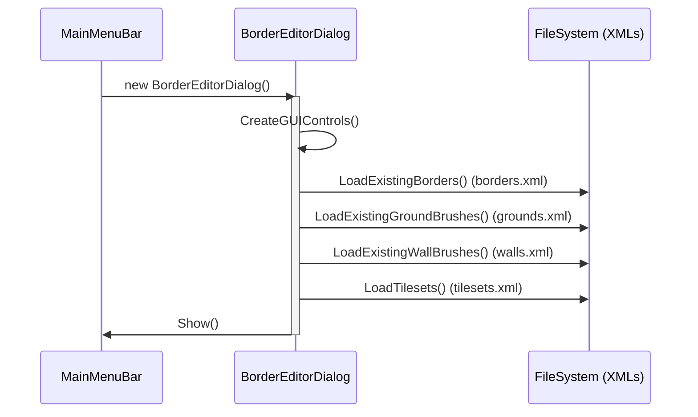

# Auto Border Editor: System Design & Architecture

## 1. System Overview
The **Auto Border Editor** is a specialized tool within the map editor designed to visually create, edit, and manage auto-border configurations. It allows users to define how terrain tiles interact (borders), create brush presets (ground/wall), and manage asset properties without manual XML editing.

## 2. Window Specifications

### Dimensions & Properties
- **Base Class**: `wxDialog`
- **Default Size**: `650px` (Width) x `520px` (Height)
- **Style Flags**: `wxDEFAULT_DIALOG_STYLE | wxRESIZE_BORDER` (Resizable, standard dialog decorations)
- **Parent**: Main window (`g_gui.root`)

### Launch Behavior
The editor operates as a **modeless dialog** but is managed like a singleton within the main menu context:
1. **Trigger**: `MainMenuBar::OnBorderEditor` event.
2. **Check**: If an instance exists (`border_editor_dialog != nullptr`), it brings it to focus (`Raise()`).
3. **Creation**: If null, creates a new instance and binds `wxEVT_DESTROY` to self-clean the pointer.

## 3. Visual Structure (Layout Strategy)

The UI is constructed using `wxWidgets` sizers for dynamic layout management.

### High-Level Hierarchy

### Tab 1: Border Editor Structure
- **Left Column**: Group ID (SpinCtrl), Type Flags (Optional/Ground Checkboxes).
- **Right Column**: "Load Existing" ComboBox.
- **Center Area**:
  - **Grid Panel**: 3x3 interactive grid (`BorderGridPanel`) for defining edge tiles.
  - **Input Controls**: "Item ID" SpinCtrl, "Browse" Button, "Add Manually" Button.
- **Right Area**: Preview Panel (`BorderPreviewPanel`) showing real-time tiling results.

### Tab 2: Ground Brush Structure
- **Top Row**: Tileset Selector, Server Look ID.
- **Middle Row**: Z-Order, Load Existing ComboBox.
- **Bottom Area**: List of associated items (ID + Chance) with Add/Remove controls.
- **Border Config**: Alignment (Inner/Outer) and "To None" / "Inner Border" options.

### Tab 3: Wall Brush Structure
- **Top Area**: Load Existing ComboBox.
- **Properties**: Server Look ID (SpinCtrl), Optional/Ground Flags.
- **Preview**: Visual representation of the wall brush.

## 4. Operational Logic & Data Flow

### Initialization Flow
When the dialog opens (`CreateGUIControls`), it triggers several loading routines:

### Grid Interaction Logic
The core interaction happens in the `BorderGridPanel`.

1. **User Click**: `EVT_LEFT_UP` on grid cell.
2. **Select Brush**: Logic checks the currently selected brush in the main editor palette.
3. **Extract ID**: `GetItemIDFromBrush()` helper function extracts the ID (supporting RAW, Ground, or LookIDs).
4. **Update Model**: The internal `m_grid[3][3]` data structure is updated.
5. **Repaint**: `Refresh()` is called, triggering `OnPaint` to draw the sprite in the grid cell.

### Persistence Strategy (Save Logic)
Each tab has its own "Save" button triggering specific serialization logic.

**Example: Saving a Border**
1. **Validation**: Check if Name != Empty.
2. **XML Load**: Open `data/materials/borders.xml`.
3. **Search**: Check if a border with the same `name` exists.
   - **If Exists**: Prompt override. If Yes, update attributes.
   - **If New**: Append new `<border>` node.
4. **Serialize**:
   - Write `id`, `group`, `ground` (bool), `optional` (bool).
   - Iterate grid: For each non-empty cell, write `<item id="..." edge="..."/>` mapping the 3x3 grid position to edge constants (N, S, E, W, CNW, etc.).
5. **Flush**: Save file to disk.

## 5. Key Classes & Files

| Class | File | Responsibility |
|-------|------|----------------|
| `BorderEditorDialog` | `border_editor_window.cpp/h` | Main container, event handling, logic integration. |
| `BorderGridPanel` | `border_editor_window.cpp` | Custom control for the 3x3 interactive editing grid. |
| `BorderPreviewPanel` | `border_editor_window.cpp` | Renders the tiling preview based on current configuration. |
| `BorderItem` | `border_editor_window.h` | Struct holding Position + ItemID pairs. |
